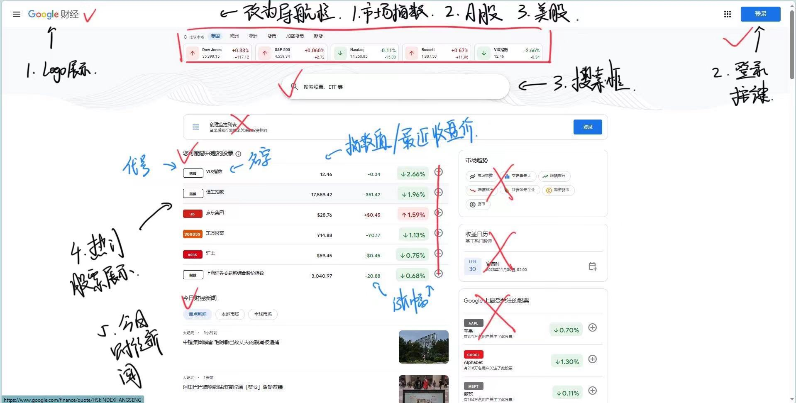
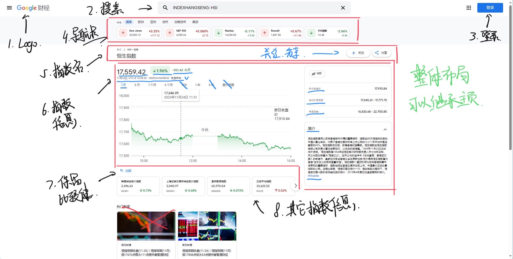
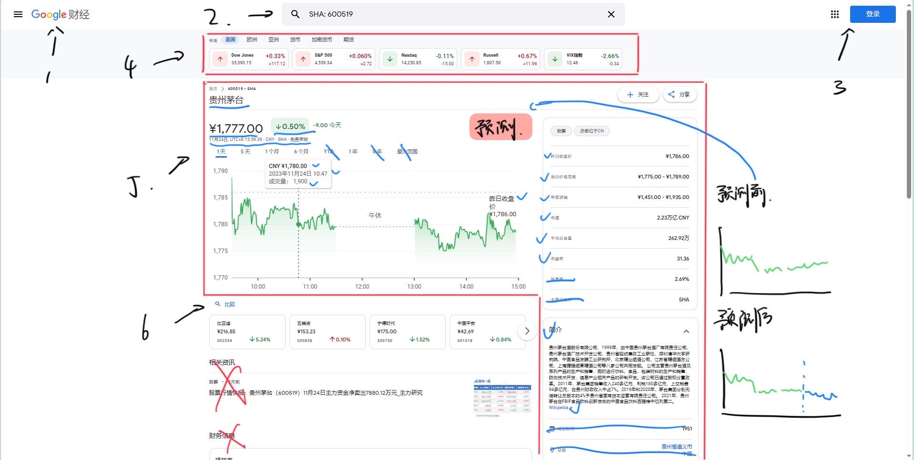

# 前端设计

## 1.主页



## 2.市场指数页



## 3.股票页




# 股票预测平台 API 文档


## 首页

### 1. 获取热门股票

**Endpoint:** `/api/hot_stocks/`

**Method:** `GET`

**Response:**

```json
[
  {
    "stock_symbol": "AAPL",
    "company_name": "Apple Inc.",
    "latest_close_price": 150.25,
    "change_amount": 2.50,
    "change_percentage": 1.68
  },
  // ... (前十支热门股票)
]
```

### 2. 搜索股票和市场指数

**Endpoint:** `/api/search/`

**Method:** `GET`

**Parameters:**

- `query` (string): 搜索关键字

**Response:**

```json
[
  {
    "result_type": "stock",
    "symbol": "AAPL",
    "company_name": "Apple Inc."
  },
  {
    "result_type": "index",
    "symbol": "NASDAQ",
    "index_name": "NASDAQ Composite"
  },
  // ... (其他搜索结果)
]
```

### 3. 获取今日财经新闻

**Endpoint:** `/api/todays_news/`

**Method:** `GET`

**Response:**
```json
[
  {
    "news_title": "Title 1",
    "news_content": "Content 1",
    "news_link": "https://googlefinance.com/news/1"
  },
  {
    "news_title": "Title 2",
    "news_content": "Content 2",
    "news_link": "https://googlefinance.com/news/2"
  },
  // ... (其他新闻)
]
```

### 4. 用户注册

**Endpoint:** `/api/register/`

**Method:** `POST`

**Parameters:**
- `email` (string): 用户邮箱
- `password` (string): 用户密码

**Response:**
```json
{
  "message": "Registration successful. Please check your email for verification."
}
```

### 5. 用户登录

**Endpoint:** `/api/login/`

**Method:** `POST`

**Parameters:**
- `email` (string): 用户邮箱
- `password` (string): 用户密码

**Response:**

```json
{
  "message": "Login successful.",
  "token": "your_jwt_token"
}
```

### 6. 获取导航栏信息

**Endpoint:** `/api/markets/`

**Method:** `GET`

**Response:**
```json
[
  {
    "market_name": "市场指数",
    "link": "/markets/indexes/"
  },
  {
    "market_name": "A股",
    "link": "/markets/a_shares/"
  },
  {
    "market_name": "美股",
    "link": "/markets/us_stocks/"
  },
  // ... (其他市场)
]
```

---

## 股票页

### 1.**股票信息接口：**

- 路由：`/api/stock/{symbol}/`

- 请求方式：GET

- 示例请求：`GET /api/stock/EXM/`

- 示例响应：

  ```json
  jsonCopy code{
    "stock_name": "Example Stock",  // 股票名称
    "symbol": "EXM",  // 股票唯一标识符
    "current_price": {
      "price": 120.45,  // 最新股价
      "timestamp": "2023-01-03T10:30:00Z"  // 获取最新股价的时间
    },
    "previous_close": 118.20,  // 昨日收盘价
    "price_range": {"low": 118.10, "high": 121.80},  // 当日价格范围
    "annual_volatility": 15.5,  // 年度波幅
    "market_cap": "10B",  // 市值
    "average_volume": "2M",  // 平均交易量
    "PE_ratio": 25.5,  // 市盈率
    "brief_description": "A brief description of the stock."  // 简介
  }
  ```

### 2.**股价变化可视化接口：**

- 路由：`/api/stock/{symbol}/price_chart/`

- 请求方式：GET

- 参数：`time_range`（可选，可取值为 "1D", "5D", "1M", "6M", "1Y" 等）

- 示例请求：`GET /api/stock/EXM/price_chart/?time_range=5D`

- 示例响应：

  ```json
  jsonCopy code{
    "time_range": "5D",  // 选择的时间范围
    "price_data": [
      {"time": "2023-01-01", "price": 118.20},  // 数据点，包含时间和价格
      {"time": "2023-01-02", "price": 119.50},
      // Other data points...
    ]
  }
  ```

## 指数页

### 1. **市场指数信息接口：**

- 路由：`/api/index/{index_code}/`

- 请求方式：GET

- 示例请求：`GET /api/index/IXM/`

- 示例响应：

  ```json
  jsonCopy codejsonCopy code{
    "index_name": "Example Index",  // 指数名称
    "index_code": "IXM",  // 指数唯一标识符
    "current_price": {
      "price": 2500.75,  // 最新指数价
      "timestamp": "2023-01-03T10:30:00Z"  // 获取最新指数价的时间
    },
    "previous_close": 2498.20,  // 昨日收盘价
    "price_range": {"low": 2498.10, "high": 2510.80},  // 当日价格范围
    "annual_volatility": 8.5,  // 年度波幅
    "brief_description": "A brief description of the index."  // 简介
  }
  ```

### 2. **指数变化可视化接口：**

- 路由：`/api/index/{index_code}/price_chart/`

- 请求方式：GET

- 参数：`time_range`（可选，可取值为 "1D", "5D", "1M", "6M", "1Y" 等）

- 示例请求：`GET /api/index/IXM/price_chart/?time_range=5D`

- 示例响应：

  ```json
  jsonCopy codejsonCopy code{
    "time_range": "5D",  // 选择的时间范围
    "price_data": [
      {"time": "2023-01-01", "price": 2498.20},  // 数据点，包含时间和价格
      {"time": "2023-01-02", "price": 2500.50},
      // Other data points...
    ]
  }
  ```
