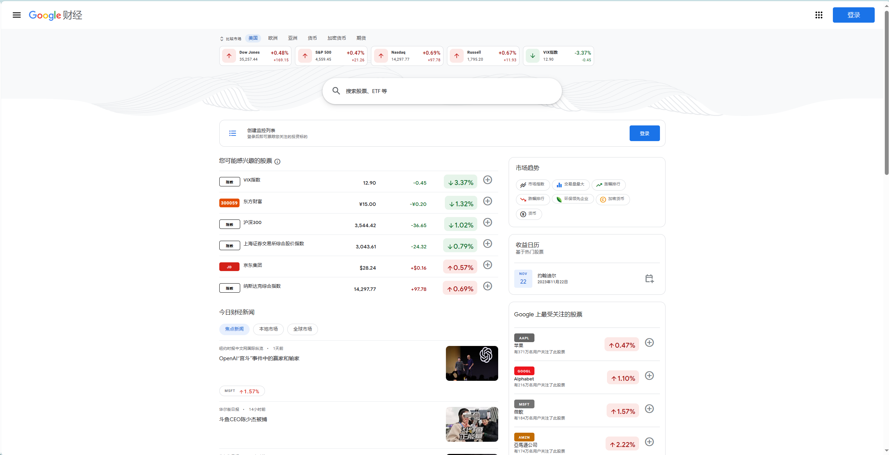
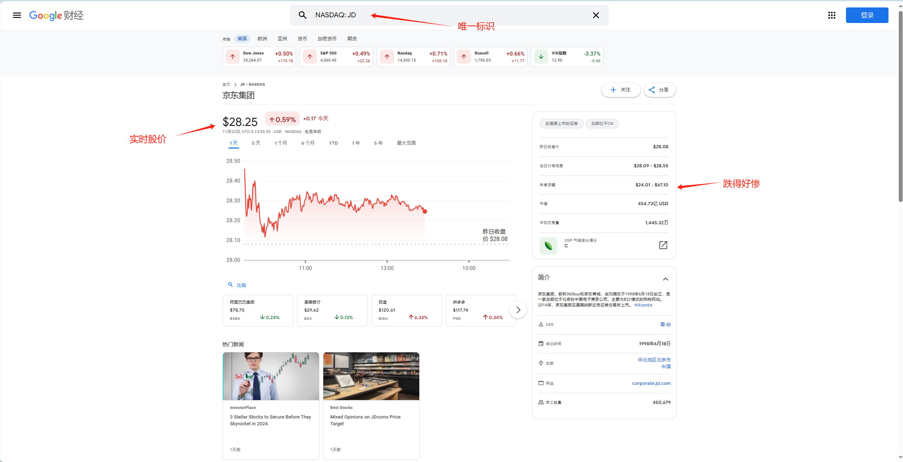
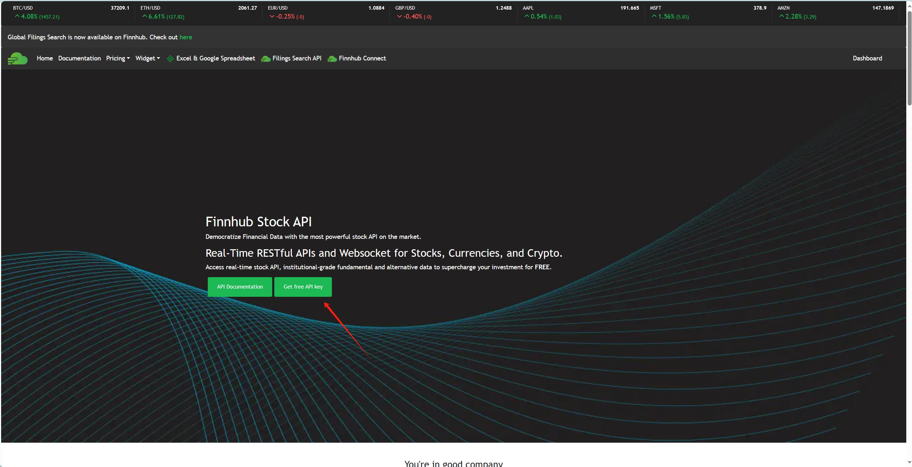
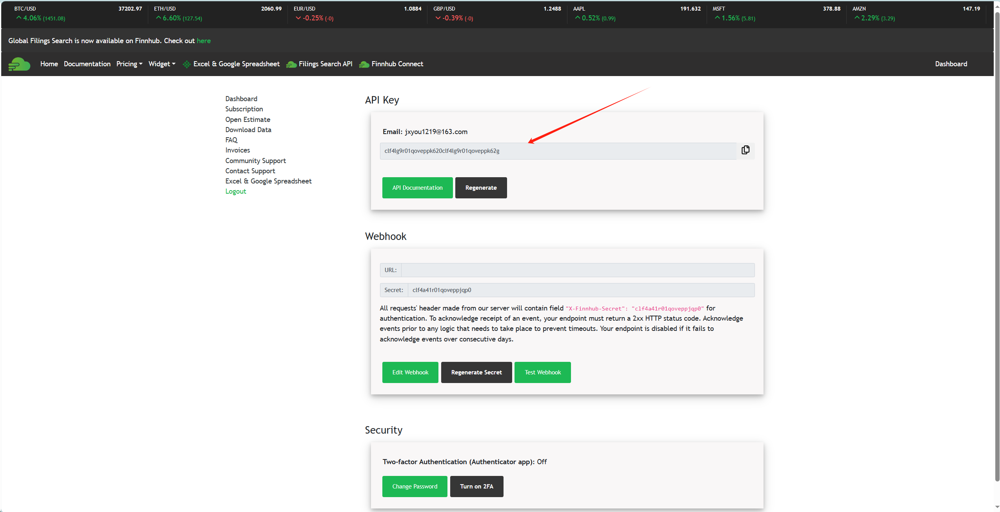
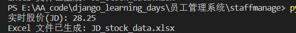
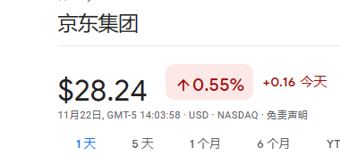
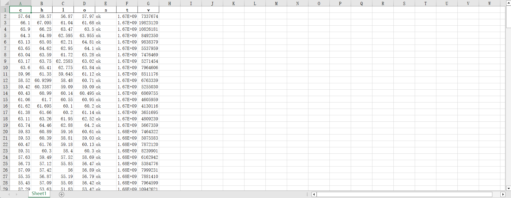

# 股票数据获取

## 1.访问Google财经获得目标股票的唯一标识符

[Google 财经 - 股市价格、实时报价和商业资讯](https://www.google.com/finance/)



以京东为例：


获得京东的唯一标识：JD

## 2.API调用

[Finnhub Stock APIs - Real-time stock prices, Company fundamentals, Estimates, and Alternative data.](https://finnhub.io/)



注册一个账号



获得api密钥

## 3.获取实时股价与历史数据

### python代码

- 注意更换密钥
- 注意更换股票唯一标识符
- 注意更换始末时间

```python
import requests
import time
import pandas as pd

api_key = "clf4lg9r01qoveppk620clf4lg9r01qoveppk62g"  #密钥
symbol = "JD" #股票唯一标识符
start_date = "2023-01-01" #始末时间
end_date = "2023-11-22"

# 将开始日期和结束日期转换为时间戳
start_timestamp = int(time.mktime(time.strptime(start_date, "%Y-%m-%d")))
end_timestamp = int(time.mktime(time.strptime(end_date, "%Y-%m-%d")))

url = f'https://finnhub.io/api/v1/quote?symbol={symbol}&token={api_key}'
response = requests.get(url)
data = response.json()

# 输出实时股价
print(f"实时股价({symbol}): {data['c']}")

url = f'https://finnhub.io/api/v1/stock/candle?symbol={symbol}&resolution=D&from={start_timestamp}&to={end_timestamp}&token={api_key}'
response = requests.get(url)
data = response.json()

# 使用 pandas 处理数据
df = pd.DataFrame(data)


# 将数据保存为 Excel 文件
df.to_excel(f'{symbol}_stock_data.xlsx', index=False)

# 输出文件名
print(f"Excel 文件已生成: {symbol}_stock_data.xlsx")
```

- 运行结果：
  

​	对比谷歌财经：



​	说明正常获得了数据

- 查看历史数据：
  

每一列标签的意义：

- `t`：时间戳，表示数据点的时间。
- `o`：开盘价。
- `h`：最高价。
- `l`：最低价。
- `c`：收盘价。
- `v`：成交量。

至此，完成训练数据的获取